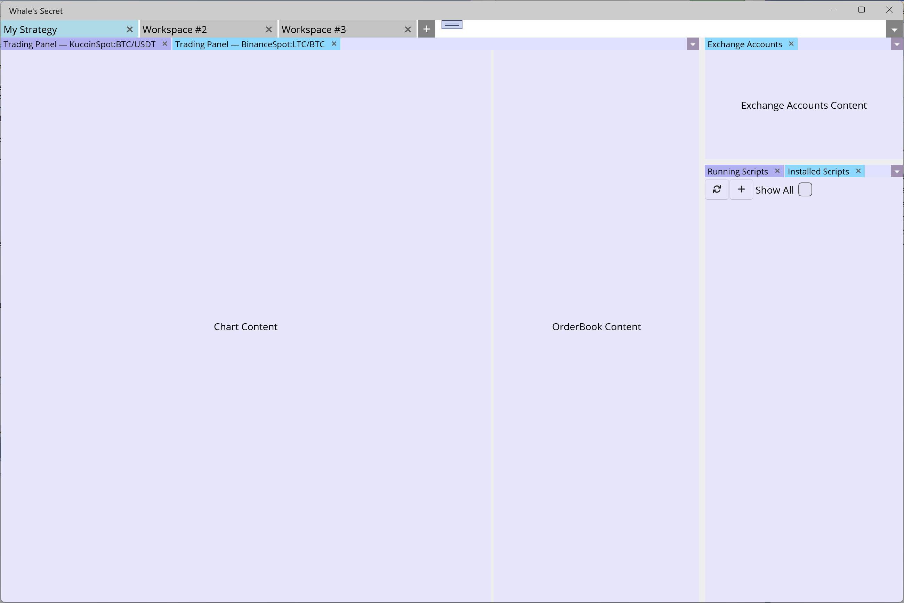

# Whale's Secret UI Design

## Intro
We are building a desktop software that runs on Windows and macOS. We are using MAUI. We are software developers but we are not good at graphic design. Also UX is not our strongest skill. We need help with that.

We have already built about 85% of the backend code and perhaps 15% of the frontend code. Below we present our current, almost "design-less" (i.e. ugly design), and also very incomplete, frontend and your task will be to show us how you would improve that and develop that further. You do not need to respect the UI that we present below - if you think we made a bad decision somewhere that leads to poor UX, we encourage you to suggest how to change it. 

## Tasks

### Task 1
The first task is to design the dashboard screen that contains several tools (see below). In this task, we are only interested in overall look, so you **should not** design effects (i.e. changes in visuals in certain events, such as hovering cursor over element, pressing a button etc.).

We would like to see light and dark theme. So you should give us two different versions of the same design - one in a light theme and one in a dark theme. 

### Task 2
If we like your task 1 design we will ask you for more work. Here we will need you to design all the visual effects, this includes change when cursor comes over an element, change when an element is disabled or pressed etc.

This again should come in both light and dark themes.

### Task 3
When task 2 is finished, we would like to redesign our Connect, Register, and Sign In windows (see below).

And again, light and dark themes are required.

## Our Software
The software we are building is a trading assistant that is supposed to help both professional and hobby traders on digital markets (think Binance, Kraken, OKex, Kucoin, Poloniex, OKcoin, ...) trading the digital assets (coins, tokens, stablecoins).

The trader should be able to automate or semi-automate tasks and even program fully automated robots with our software. It should save its users time, improve the reaction time to market events, etc.

From GUI perspective, the software offers light and dark themes. The images below are mostly from the current light theme, but we want you to always deliver both themes.

The name of the software is Whale's Secret. We have this logo created for it and we are happy with this logo, we want to keep it.

We also have a splash screen that is displayed when the application is started. We are also happy with this screen and we want to keep it.

## Task 1 Details - Dashboard

The dash board is the main screen, which is a screen that the users work with most of the time.

(Note that there is a small rectangular light purple artifact at the top center of the screenshots, that's not part of the design, that's just a developer's toolbox interface - please ignore that).

The dashboard consists of workspace tabs, in this case we have three of them, two with default names and one the user renamed as "My Strategy".

It is expected that the user will use only a few of workspace tabs, for example one for each different trading strategy. Workspace tabs can also be detached to their own windows, which comes handy when a user has multi-monitor setup.

### Workspace Tab - Windowing System

There is almost no content inside of the workspace tab, as you probably noticed. This is simply not finished and this is what we need to be designed - i.e. **the overall look of all of the below mentioned tools we want to be designed in Task 1**. What we have for now (functionality, not design - that we need) is what we call a "windowing system" that splits the content part of the workspace tab to several zones which are occupied by individual "tools". In the pictures above you can see some of those tools:

- Trading Panel (contains chart and order book)
- Exchange Accounts
- Open Orders
- Order History
- Installed Scripts
- Running Scripts

As you can see, multiple tools can occupy the same area, in which case they are tabbed. The windowing system allows the user to adjust the layout of each workspace tab. For example we can grab one of the inner borders (we call them resize bars) and change the above to the following:

and when we release the resize bar we get

So we managed to change size of some of the tools.

We can also grab the tool itself and move it elsewhere:

We can see there are some drop zones in the center and we dragged the tool header to the center of the drop zone, which means it should merge with the tool that is in that place. When we drop it the final layout looks like this:

Now you can see that the Installed Scripts tool and Running Scripts tool are grouped together.

Another thing we can do is closing the tabs. If we close both Open Orders and Orders History, we will see this:

Finally, we show splitting the largest panel (with two trading panels) to two separate trading panels. We do this by dragging the tool header to the bottom drop position:

As you can see on these images, there are various visual effects, but do not worry about them for Task 1. These should only be designed in Task 2. We only present it here so you understand the functionality.

Resizing of tool tabs and tool tab drag&drop animation in the current dark theme:

Finally we have right click context menus for both Workspace Tab and Tool Tab:

### Menu

Currently, there is no way to add a new tool, or re-add it if you close it. There should be a hamburger menu on the right side - i.e. another button on the right side of the workspace tab list button. Through this menu you should be able to add new instances of the tools.

### Tools

Finally, we say a few words about the tools, which are very important elements we need to design in this task.

### Trading Panel

Trading panel consists of a chart and an order book. This is very common setup. For example, go to [Binance page for trading BTC/BUSD pair](https://www.binance.com/en/trade/BTC_BUSD?_from=markets&theme=dark&type=spot) and you can see the chart and on the left side you can see the order book. That's roughly how it will look.

You should know that we will be using [Trading View Charting Library](https://charting-library.tradingview-widget.com/) to display the chart (but not the order book). So while there are ways to customize the look of the chart, there are limitations to that. Other parts of our software we will have full control of, so the design can be anything we want.

### Exchange Accounts

In exchange accounts tool the user will see their balance on exchanges where they have registered an account. We think it should be a table with a filter. One should be able to use the filter to show information only about specific exchanges, and by default, information about all exchanges should be there. So we think a table where each row represents an asset and each column represents a balance of that asset on a single exchange. Perhaps first column will be dedicated to "total" balance as a sum across all exchanges.

### Open Orders and Order History

Again this is very common in web interfaces of exchanges (such as Binance we linked above). If you have account on a platform like this, you know how it usually looks like. Usually it is a table with a filter. Here is an example from Coinase Pro:

For Open Orders, you usually have an action link or button to close the particular order, and also a button to close all of them. The filter in our case should also be able to specify which exchanges (apart from other parameters) should have their orders included in the display.

Order History will likely again be a table with a filter of the past orders. For inspiration, please see this image from Binance:

While this is a separated page on Binance, they also have this information in more compact design on the page where you trade. We need it in very compact design as well as it is just a tool with limited space.

### Installed Scripts and Running Scripts

Scripts are the core of our software. We will create many scripts ourselves, but we also allow the users to create their own scripts. A script is a program that uses our API for trading. It may be simple and implement just a single operation that is done instantly (such as creating an order), or it may be as complex as a fully automated robot that trades 24/7 without user's participation.

The user needs to obtain the script and install it. Those scripts will be listed in Installed Scripts tool. The user should be able to run them - i.e. specify input parameters and start a new instance of a script, but this is not part of the Installed Scripts tool, there just should be a way for the script to be started.

Multiple scripts and multiple instances of a single script can be run at the same time. Currently running instances should be displayed in Running Scripts tool. There the user should be able to open a window with information about the particular instance (not part of this tool, again just a link or a button must be available to jump there) and it also must be possible to stop the script or run a similar instance (again just buttons/links).

Running Scripts also provide information about their operation. They use logs on different severity levels (trace, debug, information, warning, error) and the user should be informed about whether there are any problems. So in Running Scripts we should display the number of these logs. Maybe just the top three severity levels - information, warning, and error.

## Task 2 Details - Dashboard Visual Effects

We would like all active controls to have some visual effect when the cursor is over them. Also all controls that can be pressed should have visual effect when they are pressed.

### Workspace Tab Add Button

The plus button on the right side of the last workspace tab can be used to add a new tab. 

### Workspace Tab List

The down arrow button in the right top corner can be used to list tabs - see the next screenshot:

### Tool Tab List

Similarly, we have this list for tool tabs:

### What To Do

In images of Task 1 above you could see various visual effects. All those should be redesigned here in Task 2. This includes, but is not limited to

* hover, pressed effects for all buttons:
  * workspace + button
  * down arrow workspace tab list button
  * down arrow tab tool list button
  * all close buttons (X)
* workspace tab list itself
* tool tab list itself
* right click context menus
  * for workspace tab 
  * for tool tab
* visual effect when a workspace tab header is being dragged
* visual effect when a tool tab header is being dragged
* drop zone cross that is displayed when a tool tab is being dragged to another place
* drop target preview (currently in green overlay, see Task 1 images above)
* windowing system resizing effect (currently in blue overlay)

## Task 3 Details - Connect, Register, Sign In
The software can be run in the single user mode or the multi-user mode. We expect most users to run it in the single user mode. However, if the user runs it in the multi-user mode, there are some initial screens related to selection of the backend server to connect to and users credentials, which currently look as you can see below.

In this task we want both - the overall look as well as all visual effects (here we have primary and secondary buttons, they can be hovered, pressed, disabled, ...).

### Connect GUI to Backend

### Register New User

### Sign In User

### Form Validation and Submission Errors

On those screens we have two types of errors that can be communicated to the user - errors in the format of input values (e.g. something is required and must not be empty) and errors reported by the server application (e.g. bad credentials).

